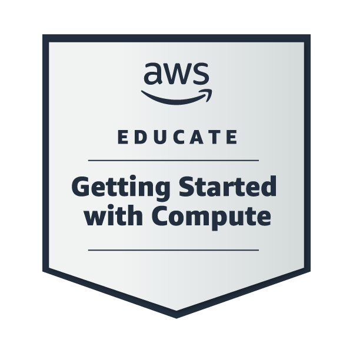

<h1 align="center">Hey Everyone 👋, I'm Prakash Satvi</h1>
<h3 align="center">A passionate and motivated aspiring Data Analyst from India.</h3>

<h3 align="left">📊 About Me</h3>

I have completed my degree in Computer Science from Mumbai University, India. 
I am passionate about transforming raw data into meaningful insights that drive decision-making. 
I enjoy working with data, building dashboards, performing analysis, and solving real-world business problems.

- 🌱 I’m currently learning **Advanced SQL, Power BI & Data Visualization**
- 📊 Exploring **Data Cleaning, EDA & Business Intelligence**
- 👨‍💻 All of my projects are available at: https://github.com/praks7v
- 📫 How to reach me: **prakswebtech@gmail.com**

<h3 align="left">🛠️ Data Analytics Toolkit:</h3>

- **Languages:** Python, SQL  
- **Libraries:** Pandas, NumPy, Matplotlib, Seaborn  
- **Databases:** MySQL, PostgreSQL, MongoDB  
- **Visualization Tools:** Power BI, Excel  
- **Other Tools:** Git, Jupyter Notebook  

<h3 align="left">📈 What I Do:</h3>

✔️ Data Cleaning & Preprocessing  
✔️ Exploratory Data Analysis (EDA)  
✔️ Dashboard Creation  
✔️ Business Insights & Reporting  
✔️ SQL Query Optimization  

<h3 align="left">My Badges:</h3>

<h3 align="left">Languages and Tools:</h3>

                     

&nbsp;

### 🔝 Top Contributed Repo

<h3 align="left">📌 Currently Looking For:</h3>

- Entry-level Data Analyst roles  
- Internship opportunities in Data Analytics  
- Projects involving real-world datasets  
- Networking with Data Professionals  

Feel free to reach out if you have any questions or just want to connect!

- 📫 How to reach me **prakswebtech@gmail.com**
<h3 align="left">Connect with me:</h3>

